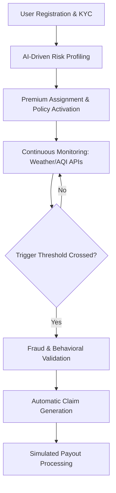

# RiskShield-Gig 🛡️
### AI-Powered Parametric Insurance for Gig Delivery Workers

[](https://opensource.org/licenses/MIT)
[](https://nextjs.org/)
[](https://github.com/Mekala-Sanjith3/RiskShield-Gig)

---

## 🚀 Overview

**RiskShield-Gig** is a parametric insurance platform designed to protect gig delivery workers from income loss caused by real-world disruptions such as heavy rain, poor air quality, and mobility restrictions.

Unlike traditional insurance systems, **RiskShield-Gig** eliminates manual claims and paperwork by using **automated trigger-based payouts** driven by live environmental data and machine learning.

---

## 🔄 Featured Module Workflows

### 🧠 1. AI-Driven Policy Purchase
The onboarding flow is designed for transparency. Unlike traditional "black-box" pricing, we use **Explainable AI (XAI)** to build trust.
1. **City Selection**: Worker provides their primary delivery hub (e.g., Hyderabad, Guntur).
2. **XAI Factor Visualization**: The system fetches live data and displays the **top 3 risk drivers** (Humidity, AQI, Wind Speed).
3. **Risk Scoring**: Our ML service (Python Flask) calculates a score (0-100) based on these drivers.
4. **Tier Assignment**: The score maps to a Weekly Premium tier:
   - **0-30**: Tier 1 (₹20)
   - **31-60**: Tier 2 (₹30)
   - **61+**: Tier 3 (₹40)

---

### 📡 2. Real-Time Parametric Monitoring
The platform maintains a background poller to ensure zero-touch functionality.
1. **Background Job**: The Express backend polls OpenWeatherMap every 30 seconds for all active zones.
2. **Parametric Trigger**: If Rainfall exceeds **5mm/hr**, the system initiates the claim pipeline.
3. **Dashboard Sync**: The Next.js frontend uses a `useEffect` hook to poll `/check-risk` every 30s, ensuring the user sees the "Claim Triggered" status the moment it happens.

---

### 🛡️ 3. Fraud & Verification Tiers
Verified claims are paid out instantly, while suspicious one enter tiered verification.
- **Score 0–40 (Low Risk)**: **Instant Payout**. Automatic UPI transfer (simulated).
- **Score 41–70 (Medium Risk)**: **Soft Verification**. Requires an OTP and a 60-second activity check.
- **Score 71–100 (High Risk)**: **Manual Review Queue**. Admin review required before payout.

---

### 🧪 4. Hackathon Simulation Flow
For demonstration purposes, you don't need to wait for a storm to see the product in action.
1. **Subscription**: Activate a policy via the UI.
2. **System Simulation**: Access the Simulation Engine (or use the provided `POST /simulate-rain` endpoint).
3. **End-to-End Payout**: Within seconds, the dashboard will transition from **"Active Coverage"** to **"Claim Approved — ₹500 Processing"**.

---

## 🔄 Main System Lifecycle



---

## 🧠 Core Features

- **Dynamic Risk Profiling**: Location-aware risk scoring using live city data.
- **Explainable AI (XAI)**: Visualize the factors (Rain, Wind, Pollution) behind your premium.
- **Automated Trigger System**: Parametric triggers (Rainfall > 5mm) to automate claim filing.
- **Behavioral Fraud Detection**: Isolation Forest model detects GPS spoofing and anomalies.
- **State Persistence**: Policy state and registration are saved via `localStorage` and `MySQL`.
- **Simulation Engine**: Forced trigger mode for instant demonstration of the payout flow.

---

## 🏗️ System Architecture

- **Frontend**: Next.js 15 (App Router) + Tailwind CSS + Framer Motion.
- **Backend API**: Node.js / Express (Auth, DB Management, Risk Engine).
- **ML Engine**: Python Flask + Scikit-learn (Risk Scoring & Fraud signals).
- **Trigger System**: Parametric Poller (Simulated & Real-time API data).
- **Database**: MySQL (Workers, Policies, Claims).

---

## 🛠️ Setup Instructions

### 1. Backend (API)
```bash
cd backend
npm install
node server.js
```

### 2. ML Service (Flask)
```bash
cd ml-model
pip install -r requirements.txt
python app.py
```

### 3. Frontend (UI)
```bash
cd frontend
npm install
npm run dev
```
*Access at: http://localhost:3000*

---

## 🎥 Project Explanation

[Watch our Detailed Project Explanation](https://youtu.be/S_f2gr-ICAk)

---

## 🎥 Final Project Demo

[Watch our Full High-Fidelity Demo](https://youtu.be/RnA6Skhpx0M)

---

## 👥 Meet Team Prime AutoBots

| Name | Role |
|------|------|
| **Vamsee Krishna** | AI & Security Specialist |
| **Sanjith** | Lead Developer & System Architect |
| **Gade Naga Chetan** | Frontend Developer & UI/UX |
| **Yashwanth** | Backend Developer & DB Engineer |

---
*Developed for Guidewire DEVTrails 2026 Hackathon.*
