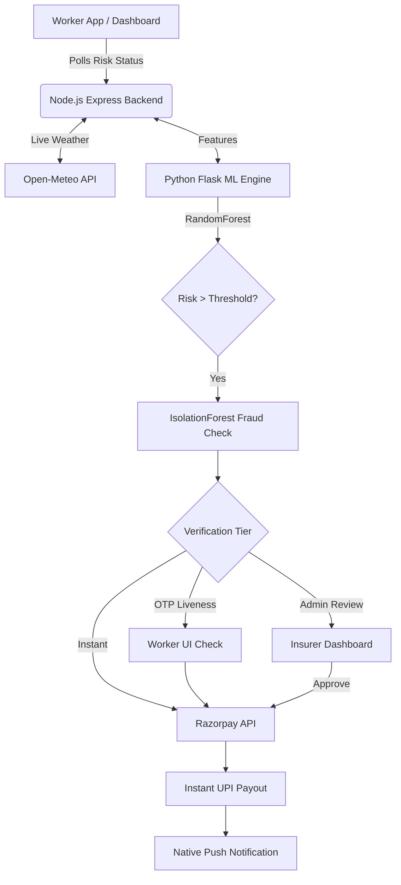

# RiskShield-Gig 🛡️
### AI-Powered Parametric Income Protection for Gig Delivery Workers

[](https://opensource.org/licenses/MIT)
[](https://nextjs.org/)
[](#)

---

## Overview

**RiskShield-Gig** is a next-generation parametric insurance platform built specifically for the gig economy. It protects delivery partners from income loss caused by real-world disruptions (heavy rain, severe heat, poor air quality, and mobility restrictions).

Unlike traditional insurance systems that rely on slow, manual claims and tedious paperwork, RiskShield-Gig uses **automated trigger-based payouts** driven by live environmental APIs, predictive machine learning, and behavioral fraud detection. 

---

## Core Pillars & Features

### 1. Predictive AI & Parametric Triggers
* **Real-Time Environmental Monitoring**: The Node.js backend continuously polls Open-Meteo APIs for live weather data across major Indian cities.
* **Predictive ML Risk Scoring**: A Python Flask service running a `RandomForestClassifier` calculates real-time risk scores based on granular weather telemetry (rain, wind, heat, AQI).
* **7-Day Risk Forecast**: Predictive analytics project risk conditions and estimated claim volumes up to 7 days in advance.
* **Zero-Touch Automation**: When environmental triggers are met (e.g., rainfall > 5mm/hr), parametric claims are automatically initiated.

### 2. Advanced Fraud Detection & Tiered Verification
Replaces basic heuristics with a robust Machine Learning pipeline:
* **Behavioral Analysis**: An `IsolationForest` ML model analyzes claim telemetry to detect anomalies.
* **GPS Spoofing & Velocity Checks**: Detects impossible travel speeds (e.g., claiming from Delhi 5 minutes after being in Bengaluru) and accelerometer flatlines.
* **Tiered Verification Flow**:
  - **Tier 1 (Instant)**: Trusted claims (Score 0-40) are instantly paid out.
  - **Tier 2 (OTP Liveness)**: Mid-risk claims (Score 41-70) trigger a 60-second OTP countdown and liveness check.
  - **Tier 3 (Admin Queue)**: High-risk claims (Score 71+) are flagged for manual insurer review.

### 3. Instant Settlements (Razorpay Integration)
* **Real-Time Payouts**: Approved claims automatically trigger the Razorpay Payouts API to send funds directly via UPI.
* **UPI Receipt Deep-Links**: Workers receive detailed GPay/PhonePe style receipts with UTR numbers and transaction IDs.
* **Earnings Protection Widget**: The dashboard visually tracks the worker's weekly earnings target and the percentage protected by parametric payouts.

### 4. Admin Intelligence & Underwriting
A comprehensive dashboard for insurers to monitor platform health:
* **Live Loss Ratio Gauge**: Real-time tracking of `(Total Payouts / Total Premiums Collected)`.
* **Fraud Analytics**: Visual heatmaps of city-level fraud attempts and a breakdown of the top flagged ML signals.
* **Manual Review Queue**: Dedicated portal for admins to review and approve/reject high-risk claims with full visibility into the AI's `fraudAuditTrail`.

---

## System Architecture



---

## Technology Stack

* **Frontend**: Next.js 15 (React), Tailwind CSS, Recharts, Framer Motion
* **Backend API**: Node.js, Express.js
* **ML Engine**: Python, Flask, Scikit-Learn, Pandas
* **Integrations**: Open-Meteo API, Razorpay Payouts API
* **State/Data**: Native Context API, Node.js In-Memory State (designed for easy porting to MySQL/Postgres)

---

## Setup & Installation

### 1. Backend (Node.js API)
```bash
cd backend
npm install
node server.js
```
*Runs on `http://localhost:5000`*

### 2. ML Engine (Python Flask)
```bash
cd ml-model
pip install -r requirements.txt
python app.py
```
*Runs on `http://localhost:5001`*

### 3. Frontend (Next.js)
```bash
cd frontend
npm install
npm run dev
```
*Runs on `http://localhost:3000`*

---

## Demo Guide

1. **Buy Policy**: Navigate to the `Buy Policy` tab and purchase a tier (Credit Card or UPI mock).
2. **Worker Dashboard**: Watch the live risk chart update every 30 seconds.
3. **Trigger Claim**: Click the **"Simulate Rainstorm"** button in the sidebar to artificially cross the risk threshold.
4. **See Payout**: Watch the claim process, trigger a native push notification, and view the Razorpay UPI receipt in the `Payment` tab.
5. **Simulate Fraud**: Click the **"Inject Fraud Claim (Demo)"** button to send a spoofed GPS claim and watch the ML engine flag and reject it.
6. **Admin Panel**: Visit the `Admin Analytics` tab to see the Loss Ratio update, the 7-Day ML forecast, and the Fraud Signal charts.

---

## Demos

* [Watch our Detailed Project Explanation](https://youtu.be/S_f2gr-ICAk)
* [Watch our Full High-Fidelity Demo](https://youtu.be/RnA6Skhpx0M)

---

## Team Prime AutoBots

| Name | Role |
|------|------|
| **Vamsee Krishna** | AI & Security Specialist |
| **Sanjith** | Lead Developer & System Architect |
| **Gade Naga Chetan** | Frontend Developer & UI/UX |
| **Yashwanth** | Backend Developer & DB Engineer |

---
*Developed for Guidewire DEVTrails 2026 Hackathon.*
