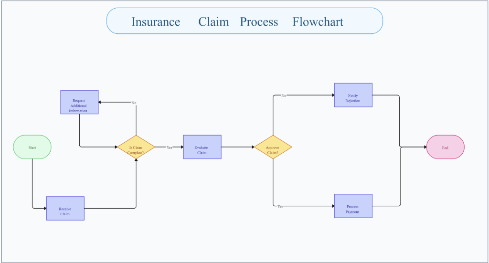
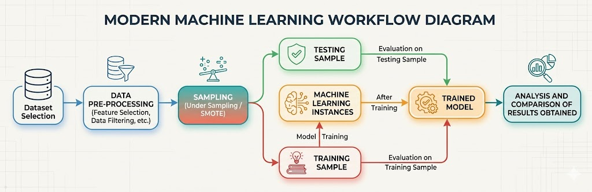
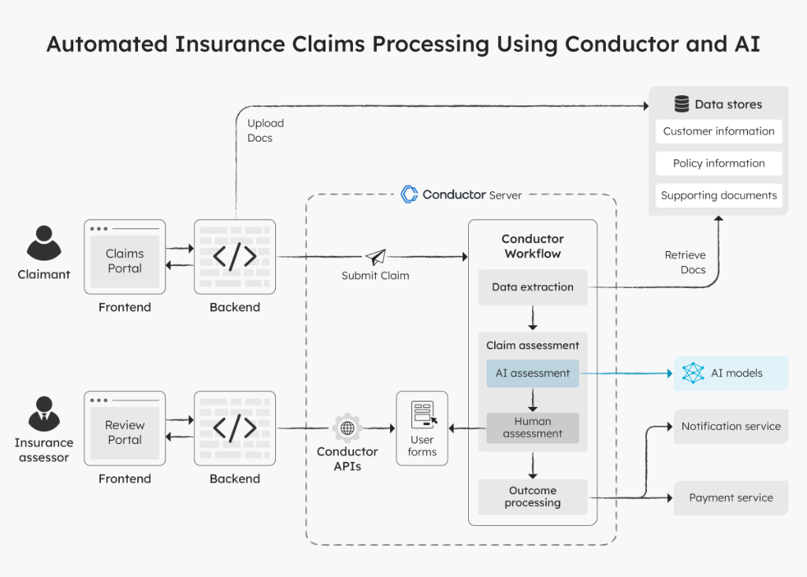
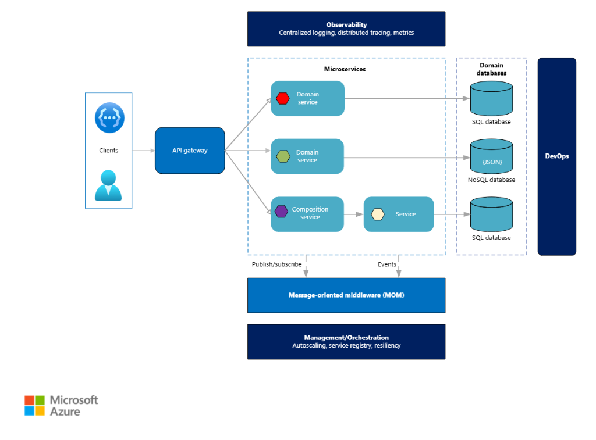

# RiskShield-Gig 🛡️

**AI-Powered Parametric Insurance for Gig Delivery Workers**

[](https://opensource.org/licenses/MIT)
[](https://devtrails.guidewire.com/)

Guidewire DEVTrails 2026 | Team: Prime AutoBots

---

## 📌 The Problem

India has over 12 million gig delivery workers. Most of them earn between ₹10,000 and ₹15,000 a month — roughly ₹600 to ₹800 a day — working for platforms like Swiggy and Zomato. When a heavy rainstorm hits, when a city-wide curfew is announced, or when flooding shuts down entire zones, these workers simply stop earning. There is no compensation. No claim to file. No safety net.

A worker in Hyderabad during the 2024 monsoon season could lose 8 to 10 working days. That is anywhere between ₹4,800 and ₹8,000 gone — with no recourse. Traditional insurance products do not address this. They are too expensive, too complex, and built for a workforce that earns a salary, not a daily wage.

**RiskShield-Gig exists to close that gap.**

---

## 💡 Proposed Solution

RiskShield-Gig is a parametric insurance platform that monitors real-world disruption events — weather, pollution, curfews — and automatically pays out to affected workers the moment a verified trigger is hit. No forms. No manual claims. No waiting.

The worker pays a small weekly premium. When a covered disruption occurs in their active zone, the system detects it, validates it, and transfers money to their UPI account — often within minutes.

> [!IMPORTANT]
> This system strictly focuses on **income loss protection only**, excluding health, life, or vehicle-related coverage, as per hackathon constraints.

---

## 👤 Target Persona

**Segment:** Food delivery partners on Swiggy and Zomato
**Geography:** Urban Hyderabad and Guntur
**Income profile:** ₹600–800/day, week-to-week earners
**Device access:** Android smartphone, UPI-enabled bank account

**A day in Raju's life:**
Raju is a Swiggy delivery partner based in Kondapur, Hyderabad. He logs in at 10 AM and typically completes 12 to 15 deliveries by 9 PM. On a good week he takes home around ₹4,500. During monsoon season, there are weeks where he cannot step out at all. Last July, he lost four straight days to flooding. ₹2,800 gone. His rent does not pause for the rain. RiskShield-Gig would have detected the flood alert, verified Raju's active zone, and paid him automatically — before he even knew a claim had been processed.

---

## 🔄 How the Platform Works



### 🧾 Onboarding
A new worker signs up using their phone number and completes a lightweight KYC — just their Aadhaar number, delivery platform ID, and UPI handle. The AI engine pulls their zone data and delivery history to build an initial risk profile.

### 💼 Weekly Premium Subscription
Once onboarded, the worker is shown their weekly premium based on their zone risk level. Premiums are deducted automatically each Monday.

| Risk Level | Weekly Premium | Basis |
|------------|---------------|-------|
| Low | ₹20 | Zone with historically low disruption frequency |
| Medium | ₹30 | Moderate flood or AQI risk history |
| High | ₹40 | Flood-prone or high-pollution zones |

### ⚡ Disruption Monitoring & Parametric Triggers
The system runs continuous checks against live data feeds. When a parameter crosses a defined threshold, the claim pipeline is triggered.

| Trigger Event | Threshold | Data Source |
|---------------|-----------|-------------|
| Heavy rainfall | Above 50mm/hr | OpenWeatherMap |
| Severe air pollution | AQI above 350 | CPCB / OpenAQ |
| Flood alert | Red alert issued | IMD / State disaster APIs |
| Curfew or zone shutdown | Official notification confirmed | Government / news APIs |

*If the trigger condition is met, the system assumes income loss and prepares the payout. This ensures a **zero-touch claim system**, where payouts are automatically triggered based on predefined external conditions without any manual intervention.*

---

## 📊 Key Platform Features (Aligned with Hackathon Requirements)

### 🧾 1. User Onboarding
- Delivery workers can register with basic details (location, platform, working zone)
- Personalized risk profiling is initialized at onboarding

---

### 💼 2. Policy Creation
- Workers can select weekly insurance plans
- AI dynamically calculates premium based on risk factors

---

### ⚡ 3. Automated Claim Triggering
- Claims are triggered automatically when parametric conditions are met
- No manual claim filing required

---

### 💸 4. Instant Payout System
- Once validated, payouts are processed instantly to worker wallets (simulated)
- Zero paperwork, zero delay

---

### 📊 5. Analytics Dashboard

#### For Workers:
- Weekly earnings protected
- Active coverage status
- Claim history

#### For Admin:
- Fraud detection alerts
- Claim statistics
- Risk predictions for upcoming disruptions

---

## 🧠 AI and Machine Learning Integration

### Dynamic Premium Pricing
We use a risk scoring model trained on historical disruption data, zone-level weather patterns, and seasonal flooding records.
Key input features:
- Rainfall intensity and frequency (last 6 months)
- Average AQI levels by zone
- Historical flood zone classification
- Delivery activity density (orders completed per km²)

### Fraud Detection
Claims are validated through a multi-signal fraud engine. The model looks at movement patterns, device signals, platform activity, and cross-worker behavior.
The scoring model is built on **Isolation Forest** for anomaly detection, combined with rule-based checks for known fraud patterns.

---

## 🛡️ Adversarial Defense and Anti-Spoofing Strategy



In a high-stakes parametric system, **GPS Spoofing** is the primary threat. RiskShield-Gig uses a layered verification architecture where GPS is just one of many inputs.

### How We Tell Real from Fake

| Signal | Genuine Worker | GPS Spoofer |
|--------|---------------|-------------|
| Movement pattern | Natural two-wheeler speed and route | Static position or instant teleportation |
| Platform activity | Recent orders attempted or active | Zero platform activity |
| Device sensors | Accelerometer and gyroscope confirm motion | No sensor activity |
| Network consistency | Cell tower location matches GPS | Mismatch between GPS and network signal |

### Data Points Beyond GPS
- **Location intelligence:** Cross-validated against WiFi and cell tower triangulation.
- **Movement analysis:** Tracks speed and route continuity.
- **Device signals:** Detects rooted devices, mock location flags, and known spoofing apps.
- **Behavioral data:** Cross-references delivery platform activity logs.
- **Crowd intelligence:** Compares flagged worker claims against nearby verified workers.

### Handling Flagged Claims Fairly
| Fraud Risk Score | Response | Worker Experience |
|-----------------|----------|------------------|
| 0 – 40 | Instant payout processed | No action needed from worker |
| 41 – 70 | Soft verification: OTP + selfie | 60-second step, clearly explained |
| 71 – 100 | Manual review queue | Worker notified with reason and timeline |

---

## ⚙️ System Architecture



### 🔗 API Flow



```text
+----------------+       +-------------------+       +-----------------------+
|  Worker App    | ----> |  Backend API      | <---> |  AI Risk & Pricing    |
| (React/Mobile) |       | (NodeJS/SpringBoot)|       | (Python/Scikit-Learn) |
+-------+--------+       +---------+---------+       +-----------+-----------+
        |                          |                             |
        |       +------------------+------------------+          |
        |       |                  |                  |          |
        |       v                  v                  v          v
+---------------+       +-------------------+       +-----------------------+
| Verification  |       | External APIs     |       | MySQL Database        |
| (Anti-Spoof)  |       | (Weather, AQI)    |       | (Users, Policies)     |
+---------------+       +---------+---------+       +-----------------------+
                                  |
                                  v
                        +-------------------+
                        | Payout Gateway    |
                        | (Auto-Claim)      |
                        +-------------------+
```

---

## 🧰 Tech Stack

| Layer | Technology |
|-------|-----------|
| Frontend | React (Progressive Web App) |
| Backend | Node.js with Express / Spring Boot |
| Database | PostgreSQL / MySQL |
| AI / ML | Python — Scikit-learn (Isolation Forest, Random Forest) |
| Integrations | OpenWeatherMap, OpenAQ, Mapbox |
| Payments | Razorpay test mode / UPI simulator |

---

## 🚀 Future Scope

- **Blockchain-based claim audit trail** for full transparency.
- **Live integration with Swiggy/Zomato APIs** for real-time activity validation.
- **WhatsApp-based notifications** and verification for improved accessibility.
- **Expansion to E-commerce delivery** (Amazon, Flipkart, Zepto).

---

## 👥 Team Prime AutoBots

| Name | Role |
|------|------|
| Sanjith | Lead Developer |
| Vamsee Krishna | AI & Security Specialist |
| Gade Naga Chetan | Frontend Developer |
| Yashwanth | Backend Developer |

---

*This project is built for the **Guidewire DEVTrails Hackathon**.*
